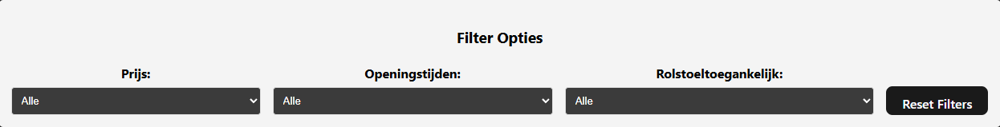
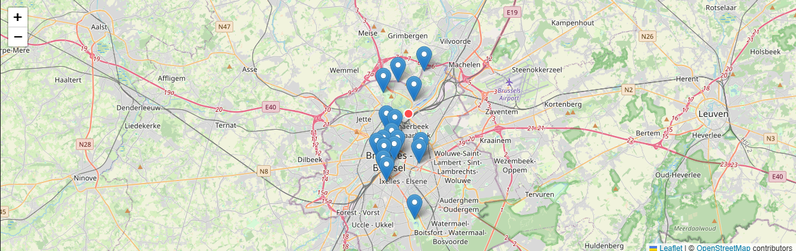
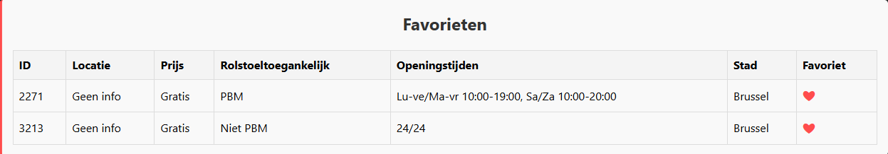
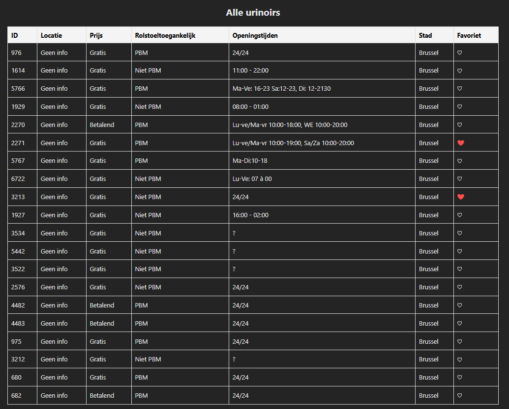

# 🧻 PotSpot - Openbare Urinoirs in Brussel

## 📋 Projectbeschrijving

Een webapplicatie die openbare urinoirs in Brussel visualiseert op een interactieve kaart met filtermogelijkheden en favorietensysteem. Gegevens worden in realtime opgehaald via de open data API van [opendata.brussels.be](https://opendata.brussels.be).

## 🚀 Functionaliteiten

- 🔎 **Filters** op prijs (gratis/betaald), openingsuren en rolstoeltoegankelijkheid
- 🗺️ **Interactieve kaart** (Leaflet) met markers van urinoirs
- 🧡 **Favorieten** beheren en opslaan via `localStorage`
- 📋 **Responsieve tabellen** met alle gegevens per locatie
- 📱 **Mobielvriendelijk** ontwerp met aanpassingen voor kleinere schermen

## 🌐 Gebruikte API's

**Toiletten in Brussel**  
🔗 [https://opendata.brussels.be](https://opendata.brussels.be)  
- Endpoints voor openbare toiletten
- Data wordt verwerkt in JSON
- Informatie zoals: naam, adres, prijs, toegankelijkheid, openingsuren, enz.
- Geen authenticatie vereist

## 🚀 Installatiehandleiding

### Vereisten

- Node.js (versie 18 of hoger)
- NPM of Yarn package manager

### Installatie Stappen

1. **Clone de repository**
```bash
git clone https://github.com/Dries-Michiels/Project-Web-Advanced
cd my-project
```

2. **Installeer dependencies**
```bash
npm install
```

3. **Start de development server**
```bash
npm run dev
```

4. **Open in browser**
    - Navigeer naar http://localhost:5173
    - De applicatie is nu beschikbaar

### Productiebuild

```bash
npm run build
npm run preview
```

## 🛠️ Technische Implementatie

### DOM Manipulatie

**Elementen selecteren:**
- `document.getElementById()`: 
  - Filterbesturingselementen - Lijn 108-111 (main.js)
  - Records container - Lijn 197 (main.js)

**Elementen aanmaken:**
- `document.createElement()`:
  - Favorietensectie - Lijn 194 (main.js)
  - Resultatentitels - Lijn 206, 222 (main.js)
  - Tabelonderdelen (rows/cells) - Lijn 229-235, 247-252 (main.js)

**Elementen manipuleren:**
- `innerHTML`:
  - Routes HTML templates - Lijn 20-64 (main.js)
  - Favorietensectieinhoud - Lijn 195, 204 (main.js)
  - Hartpictogrammen - Lijn 252 (main.js)

**Events koppelen:**
- `addEventListener()`:
  - Filterwijzigingen - Lijn 144-146 (main.js)
  - Reset button - Lijn 149-156 (main.js)
  - Favoriettoggle - Lijn 254-261 (main.js)

### Modern JavaScript

**Variabelen & Constanten:**
- `const` declaraties - Lijn 6, 85, 172, 212, 270 (main.js)
- `let` variabelen - Lijn 87, 118 (main.js)

**Template Literals:**
- HTML structuren - Lijn 21-64 (main.js)
- Popup inhoud - Lijn 274-280 (main.js)

**Arrow Functions:**
- Fetch callbacks - Lijn 77-91 (main.js)
- Event handlers - Lijn 149-156, 254-261 (main.js)
- Renderingfuncties - Lijn 170-238 (main.js)

**Array Methoden:**
- `filter()` - Lijn 119-133 (filterlogica), 212-213 (favorietenfiltering)
- `forEach()` - Lijn 229-236, 247-265, 271-286 (itereren door items)
- Spread operator (`...`) - Lijn 85-88 (arrays van resultaten maken)

**Conditionals:**
- Ternary operators - Lijn 252, 282 (main.js)
- Kortsluitende evaluatie - Lijn 105, 198, 279 (main.js)

### Asynchrone Programmering

**Promises:**
- `fetch().then()` chains - Lijn 76-348 (main.js)
- Error handling met `.catch()` - Lijn 342-347 (main.js)

### Data Opslag

**LocalStorage:**
- Favorieten opslaan - Lijn 331-333 (main.js)
- Favorieten ophalen - Lijn 322-325 (main.js)

**JSON Manipulatie:**
- `JSON.parse()` - Lijn 324 (main.js)
- `JSON.stringify()` - Lijn 332 (main.js)

### UI & Interactie

**Kaartintegratie (Leaflet):**
- Kaart initialiseren - Lijn 93-94 (main.js)
- Markers toevoegen - Lijn 271-286 (main.js)
- Popups configureren - Lijn 274-283 (main.js)

**Filtering:**
- Filteropties definiëren - Lijn 25-46 (main.js)
- Filterlogica implementeren - Lijn 117-136 (main.js)
- Filter resetten - Lijn 149-156 (main.js)

**Favorietensysteem:**
- Favorieten markeren - Lijn 251-253 (main.js)
- Toggle functionaliteit - Lijn 306-318 (main.js)
- Favoriete items weergeven - Lijn 211-204 (main.js)

### Styling & Layout

**Flexbox Layout:**
- Filtercontroles - Lijn 113-121 (style.css)
- Container layout - Lijn 139-143 (style.css)

**Responsive Design:**
- Media queries - Lijn 194-258 (style.css)
- Aanpassingen voor mobiel - Lijn 202-215, 235-258 (style.css)

**Thema's en Stijling:**
- Dark/light mode - Lijn 259-270 (style.css)
- Kleurenschema - Lijn 7-11, 20-22 (style.css)
- Animaties en overgangen - Lijn 164-166 (style.css)

### Routing & Applicatiestructuur

**SPA Router:**
- Routerdefinitie - Lijn 6-68 (main.js)
- Routinglogica - Lijn 2-25 (router.js)
- Routeafhandeling - Lijn 12-20 (router.js)

### Tooling & Structuur

**Vite Setup**: index.html met ES6 modules  
**Router Implementatie**: router.js - Hash-based routing  
**Folderstructuur**:
```
/
├── public/
│   └── PotSpot.png
├── index.html
├── screenshots/
│   ├── alleurinoirs.png
│   ├── favorieten.png
│   ├── filter.png
│   └── kaart.png
├── src/
│   ├── main.js
│   ├── router.js
│   ├── style.css
│   └── 
└── package.json
```

## 📱 Screenshots










## 🔧 Gebruikte Bronnen

### APIs
- Open Data Brussel – Toiletten dataset https://opendata.brussels.be


### Libraries & Tools
- Leaflet.js – Kaartintegratie
- OpenStreetMap – Kaarttiles
- Vite – Snelle ontwikkelomgeving
- Vanilla JavaScript – Geen frameworks

### AI en Bronnen
- Leaflet: https://leafletjs.com/
- ReadME: Met behulp van ChatGPT en Copilot
- Project: Met behulp van Copilot Ask mode
- Openstreetmap: https://www.openstreetmap.org/
- Debuggen: Met behulp van Copilot


## 👨‍💻 Auteur
Dries Michiels